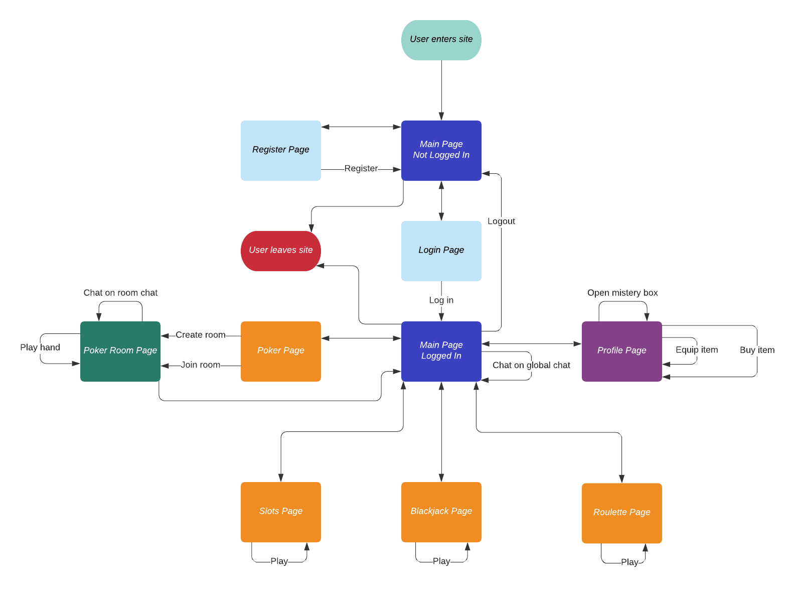

# CazinoRoial
Aplicatie Web pentru proiect MDS.

## Team members

TBC

Backlog: https://github.com/Theodorulus/CazinoRoial/projects/1

## App description

Online Casino made for those who are eager to lose virtual money.

## App demo

TBC

## User Stories
1. As a professional poker player, I want to have statistics on the hands played
2. As a fan of multiplayer games, I want to play poker online with my friends.
3. As a gambler, I want to have more gaming options. 
4. As a gamer, I wish I could talk to random players on the platform.
5. As an internet user, I would like to have my own account on the platform.
6. As an online gambler, I want to be able to set an avatar.
7. As an amateur poker player, I want to communicate with the other players in the lobby.
8. As an online gambler, I would like a simple and intuitive UI.
9. As a poker player, I want to select the lobby I will join (from a list of available lobbies).
10. As a user of the platform, I want to play Blackjack.
11. As a user of the platform, I want to play Slots.
12. As a user of the platform, I want to play Roulette.
13. As an online gambler, I want to purchase special items on the platform.
14. As a developer, I want good communication between team members.
15. As a manager, I want to know the progress of the development team, so that I can answer any questions they may have.

## UML

## Bug reporting

1. When using socket.io, if the session suddenly expired, the socket API tries to maintain the connection by querying the database with an undefined session id, resulting in the server going down. Solution: Checking if the cookie object in the request header, includes the sessionId property. Info: (https://github.com/Theodorulus/CazinoRoial/issues/26)

2. After some minor files modifications, some parts of the games controller stopped working properly. Solution: Changed the paths to the modified files. Info: (https://github.com/Theodorulus/CazinoRoial/issues/24)

## Design Patterns

TBC

## Refactoring

TBC

## Build tool

The app is using npm with custom scripts as a pseudo build tool.

## Unit tests

The unit tests are divided in 2 parts, one for backend, and one for frontend functions.
  - for backend there are tests for: login, register, get and post requests
  - for frontend there are tests for the blackjack functions: getHandValue(), winCondition(), shuffleArray() and getRandomDeck()
The frontend ones are tested on each push and pull request with github actions: https://github.com/Theodorulus/CazinoRoial/actions

